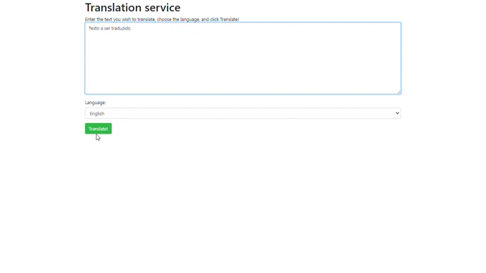

# Aplicativo Web de Tradução


 
> Projeto de criação de um aplicativo Web de IA usando Python e Flask, seguindo roteiro que se encontra no Microsoft Learn.


## 💻 Serviços utilizados
* `Python 3.6 ou superior ` 
* `Flask`
* `Serviços Cognitivos do Azure: Translate`


## 🚀Serviços Cognitivos Azure

Os Serviços Cognitivos são um conjunto de algoritmos que utilizam machine learning para solucionar problemas no campo da inteligência artificial. 

Os serviços cognitivos tornam a IA acessível a todos os desenvolvedores sem necessitar de conhecimentos em machine learning, pois esses algoritmos são transformados em pacotes e disponibilizados aos desenvolvedores para aplicação. 

Para utilizar os serviços, basta fazer uma chamada da API (Application Programming Interface) a partir da sua aplicação para adicionar a capacidade de ver (pesquisa e reconhecimento de imagem avançada), ouvir, falar, pesquisar e tomar decisões nas suas apps.

### Serviço Cognitivo de Tradução

O Tradutor é um serviço de tradução automática baseado na nuvem. Ele detecta autimaticamente o idioma de origem e pode traduzir para vários idiomas de destino em uma chamada. 

O Tradutor é integrado aos aplicatibos, sites, ferramentas e soluções e permite a tradução de textos em tempo real em mais de 70 idiomas.

Para chamar o serviço de tradução é necessário uma chave. Essa chave sempre será utilizada ao acessar o serviço. Os dados para a chamada da API estarão em um arquivo `.env`.


## 💻 Pré-requisitos

```bash
$ pip install python -m venv venv
$ source venv\scripts\activate
$ pip install -r requirements.txt
```

## 💻 .env
Deve ser criado um arquivo na raiz da aplicação nomeado `.env`. No arquivo deve-se colocar as informações do API de tradução, que se encontram em `Gerenciamento de Recursos`.

```bash
$ KEY=chave_criada
$ ENDPOINT=endpoint
$ LOCATION=localização
```
