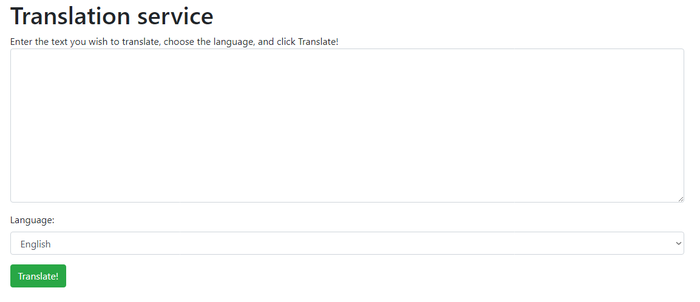

# Aplicativo Web de Tradução


 
> Projeto de criação de um aplicativo Web de IA usando Python e Flask, seguindo roteiro que se encontra no Microsoft Learn.


## 💻 Serviços utilizados
* `Python 3.6 ou superior ` 
* `Flask`
* `Serviços Cognitivos do Azure: Translate`


## 💻 Pré-requisitos

```bash
$ pip install python -m venv venv
$ source venv\scripts\activate
$ pip install -r requirements.txt
```

### Serviço de Tradução Azure
